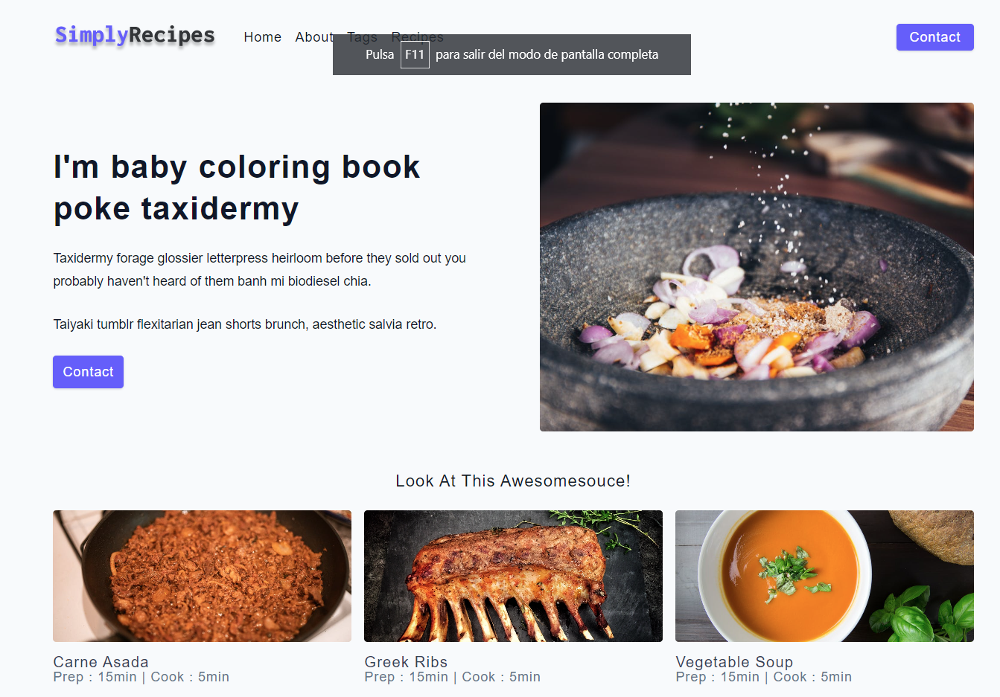
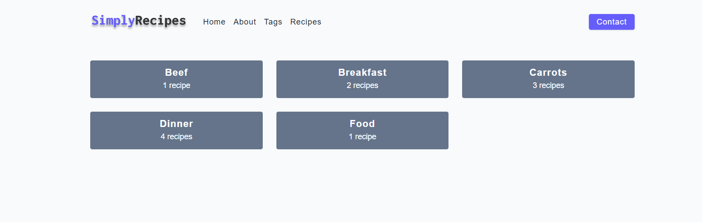
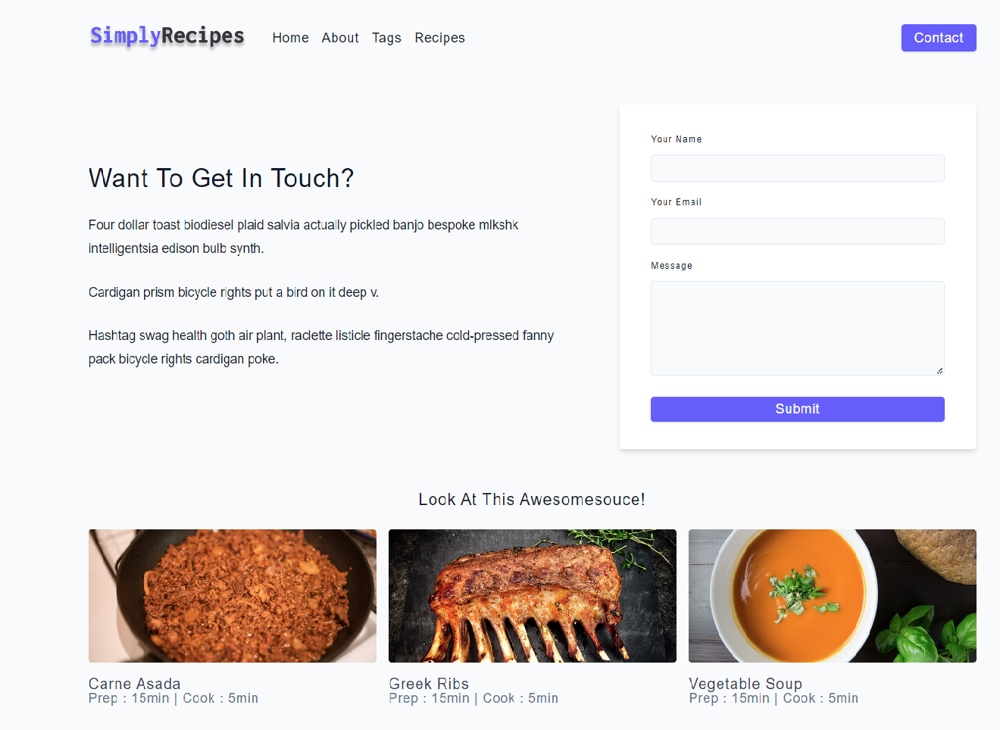
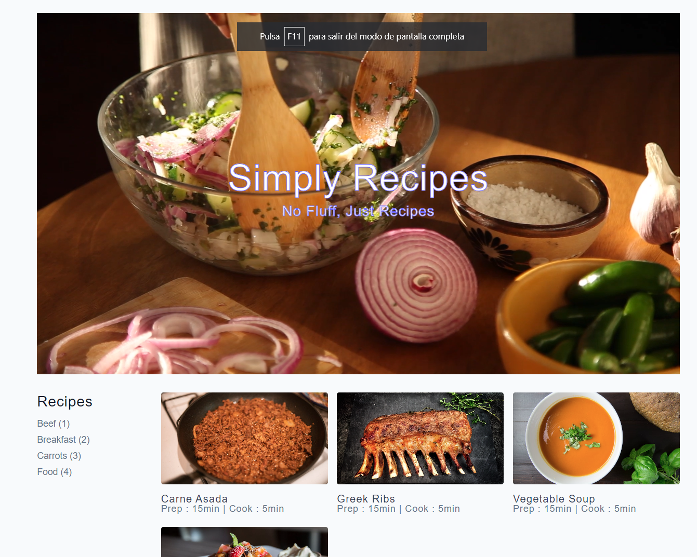
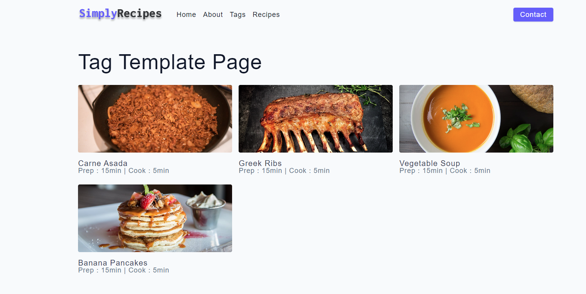
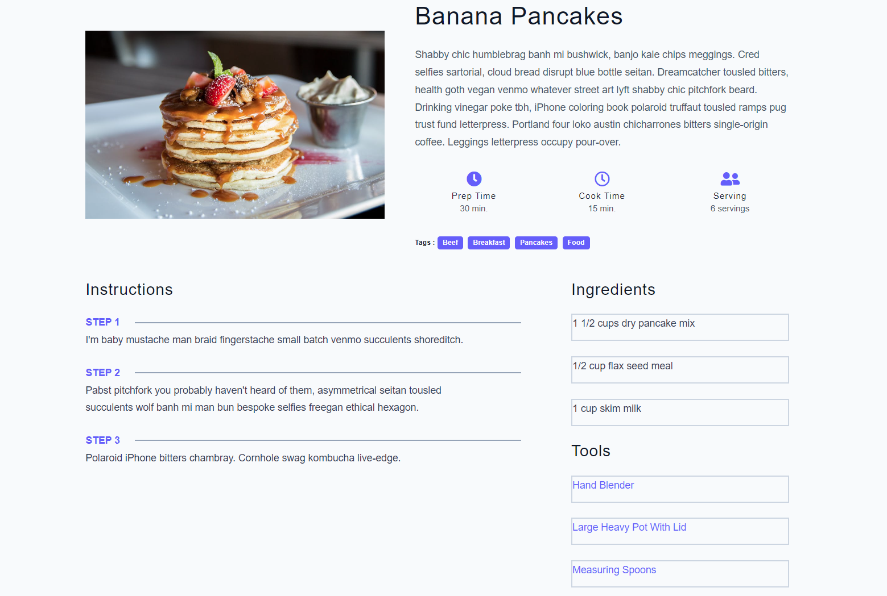

###  Estructura Carpetas del Proyecto

```
.
├── assets
    ├── recipes
        ├── recipe-1.jpeg
        ├── recipe-2.jpeg
        ├── recipe-3.jpeg
        ├── recipe-4.jpeg
    ├── videos
        ├── pexels-cristian-rojas-7601415 (Original).mp4
    ├── about.jpeg
    ├── favicon.ico
    ├── logo.svg
    ├── main.jpeg
├── css
    ├── main.css
    ├── normalize.css
    ├── pruebas.css
├── html
    ├── 404.html
    ├── about.html
    ├── contact.html
    ├── index.html
    ├── pruebas.html
    ├── recipes.html
    ├── single-recipe.html
    ├── tag-template.html
    ├── tags.html
├── js
    ├── app.js
├── README.md

```

| No | File Name | Details 
|----|------------|-------|
| 1  | index.html | Entry point

### Tecnologias Usadas:


<br />
<br />

### Secciones de la Web:

- #### About:
    
- #### Categoria Recetas:
    
- #### Página de Contacto:
    
- #### Página Principal:
      
- #### Página Categoría Recetas:
      
- #### Página Receta Individual:
      
  
  
### Funcionalidades Principales:
1. [Página Principal](http://127.0.0.1:5500/html-css-proyecto-responsive-clase/html/404.html)
2. [Página Contacto](http://127.0.0.1:5500/html-css-proyecto-responsive-clase/html/contact.html)
3. [Página Categorías Recetas](http://127.0.0.1:5500/html-css-proyecto-responsive-clase/html/tags.html)
4. [Página Categoría Individual](http://127.0.0.1:5500/html-css-proyecto-responsive-clase/html/tag-template.html)
5. [Página Principal Resultados Recetas](http://127.0.0.1:5500/html-css-proyecto-responsive-clase/html/recipes.html)
6. [Página Principal Receta Individual](http://127.0.0.1:5500/html-css-proyecto-responsive-clase/html/single-recipe.html)
7. [Página de Contacto](http://127.0.0.1:5500/html-css-proyecto-responsive-clase/html/contact.html)
7. [Página de Sobre la Empresa](http://127.0.0.1:5500/html-css-proyecto-responsive-clase/html/about.html)
7. [Página de Error Recurso No Encontrado](http://127.0.0.1:5500/html-css-proyecto-responsive-clase/html/404.html)

